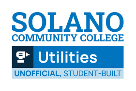
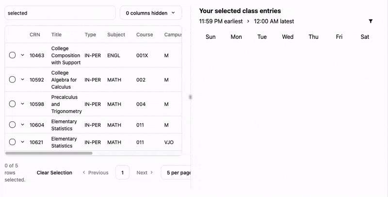

# Solano Community College Utilities

Solano Community College Utilities, or SCC Utils, is a host of tools to make the lives of the students of the college slightly easier through software.

## [Advanced Schedule Builder](https://standafer.github.io/scc-utils/scheduler/)

🚀 **Smart Class Import.**
Import the entire Solano class schedule through its custom HTML parser in milliseconds - simply save the class schedule page and the tool does the rest.

✨ **Beautiful User Interface.**
Navigate through course options with the modern, intuitive interface designed by a student for maximum efficiency.

🔍 **Powerful Filtering.**
Utilize the utilities powerful custom filtering language (Structured Table Row Operation Lookup Language) to quickly and easily\* find the perfect classes for your schedule.

⚡ **Conflict-Free Planning.**
Tired of those schedule tables counseling gives you? Automatically identify and prevent schedule conflicts before they become registration issues.

🚗 **Going between campuses? Thought of that too.**
Built-in travel time nodes occur between classes at different Solano campuses to ensure realistic scheduling across campus locations.

🔒 **Completely private.**
You can use 100% of the features without an internet connection! All procesing happens locally on your browser. [GitHub Pages](https://pages.github.com/) Privacy Policy still applies (I have no control over this).

### ...more utilities coming soon™?

## Getting Started

**If you're planning on using the Schedule Builder, please watch [the tutorial](https://www.youtube.com/watch?v=idA7ymO2aDo), as getting the classes imported requires specific instructions.** All utilities are available through [the website](https://standafer.github.io/scc-utils/)!

### Development / Contributing

Found a bug or want to add a feature? Submit a pull request or open an issue - all contributions are welcome!

`pnpm install` then `pnpm start` is all it takes to get up and running. Below are some directories that you might be useful to you.
| Important Directory | Abstract |
|-------------------------------|---------------------------------------------------|
| `src/library/filter-language` | STROLL filter language Lexer, CST, and evalulator |
| `src/library/class-entry` | Parser |
| `src/pages/scheduler.svelte` | Main scheduler page |

## License

Unlicense. Do whatever you want with the code. 🤠
